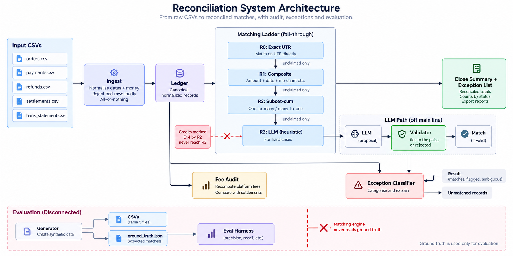

# Architecture

Five CSVs go in — orders, payments, refunds, settlements, a bank statement. A close summary
and an explained exception list come out. This document is the decisions that shape what
happens in between, in the order they were forced, with the measurements that forced them.

**Provenance.** Every measured number here carries a `*(dataset, step, date)*` tag. A number
without one is a derivation or a rule, not a measurement. This is hard rule 7 in `CLAUDE.md`,
and it exists because five numbers in this project survived a data regeneration by being
quoted forward instead of re-run. A tagged number is visibly stale-able; an untagged one
looks eternal.

**The five things worth reading this document for:**

- [The model proposed a match at confidence 100, was right, and was rejected anyway](#the-e14-incident) — being right by accident is not knowing.
- [A rival subset must survive the ladder to be a rival at all](#3-a-rival-subset-must-survive-the-ladder-to-be-a-rival-at-all) — a property of laddered matching, met three times before it was named.
- [The LLM rung added 0.00 coverage points](#5-r3s-delta-was-000-and-that-is-the-finding) — predicted before it was built, and its real job is elsewhere.
- [One exception code cannot be detected from these five files](#the-one-that-is-invisible-e11-partial-refund-drift) — a limit of the sources, not of the code.
- [Two precision trades, priced](#7-two-precision-trades-priced) — 2.16 coverage points for 4.65 precision, and one refused credit for 4.58.

---

## 0. The shape of the thing



**The five inputs**, all CSV, all exported by the merchant from their aggregator and their bank:

| File | What it is |
|---|---|
| `orders.csv` | what the customer bought, and what it should have cost |
| `payments.csv` | what was actually captured against each order, with the fee and GST charged on it |
| `refunds.csv` | money sent back — refunds and chargebacks together, since they differ only in blame |
| `settlements.csv` | the aggregator's own batches: what it netted, and what it deducted to get there |
| `bank_statement.csv` | what the bank says arrived, as free-text narration and an amount |

**Three words the rest of this document assumes.** A **settlement batch** is the aggregator
netting a day's payments down to one figure it owes the merchant — gross, minus fees, minus
GST, minus refunds, plus or minus adjustments. A **bank credit** is one row on the bank
statement: money that actually landed. The two are not one-to-one. **A single bank credit can
carry several settlement batches**, netted together into one transfer, and that fact is the
reason R2 exists and the reason ambiguity is possible at all.

**Six stages**, in order:

1. **Ingest** — identify each CSV by its header, normalise three date formats, parse money into integer paise.
2. **Validate** — report *every* unreadable row with its number and reason, then load nothing.
3. **Ladder** — R0 to R3, tying each bank credit to the settlement batches inside it.
4. **Classify** — code everything the ladder left, from the ledger and from the ladder's own record of what it attempted.
5. **Fee audit** — recompute every fee and GST from the contracted rate and compare.
6. **Report** — the close summary, the exception list, and the metrics.

---

## 1. The ladder, and why cheapest-first

Four rungs. Each one tries to tie a bank credit to the settlement batches inside it, and
through them to the payments inside those. A credit that a rung cannot claim falls to the
next. A credit no rung claims stays open and gets a code.

| Rung | Method | LLM | Cost of being wrong |
|---|---|---|---|
| **R0** | Exact: a verbatim UTR in the narration names a settlement and the amount ties | no | near zero — two independent facts agree |
| **R1** | Composite: amount within ±₹1, a ±2 day window, a partial reference | no | low — flagged if tolerance is spent |
| **R2** | Combination: which subset of open settlements sums to this credit, exactly | no | high — combinatorially many near-misses |
| **R3** | Narration parsing, entity resolution, explanation | yes | highest — non-deterministic, unauditable alone |

**Cheapest-first is not about compute.** R2's brute-force enumeration over a bounded pool
finishes in milliseconds and R3's model call is free on the current tier — ₹0 across both
seeds *(train+heldout, 6b, 2026-09-01)*. Latency was never the constraint.

The ordering is about **evidential strength, and about attribution.**

*Evidential strength.* R0 matches on two independent facts agreeing: a settlement id
recovered from a machine-emitted narration string, and an amount that ties to the paisa. It
is very hard for that to be a coincidence. R2 matches on one fact — a sum — and a sum has
combinatorially many ways to be produced. R3 matches on a model's reading. Running the
strong evidence first means the weak evidence is only ever asked about records the strong
evidence could not explain, which is the smallest possible surface for a false match. A
false match is the failure mode that matters: it hides a real break and someone signs off on
wrong books. Precision beats recall everywhere in this codebase, and rung order is the first
place it is enforced.

*Attribution.* Each rung records what it cleared, so the contribution of each is a
measurement rather than a claim. This is the whole reason PRD §15 puts the eval harness at
step 5 and the LLM at step 9 — with the ladder built bottom-up and measured at each rung,
"what did the model actually add" has an answer instead of an assumption. It turned out to be
0.00 points, and knowing that is worth more than the rung.

Measured, both seeds, on constant data *(train+heldout, 6b, 2026-09-01)*:

| | held-out R0+R1 | + R2 | + R3 | train R0+R1 | + R2 | + R3 |
|---|---|---|---|---|---|---|
| **payment coverage** | 58.24% | **88.73%** | 88.73% | 52.24% | **86.97%** | 86.97% |
| precision | 100.00% | 100.00% | 100.00% | 100.00% | 100.00% | 100.00% |
| recall | 88.37% | 100.00% | 100.00% | 81.40% | 97.67% | 97.67% |
| rung split | 32 / 6 | 32 / 6 / 5 | 32 / 6 / 5 / **0** | 23 / 12 | 23 / 12 / 7 | 23 / 12 / 7 / **0** |

**Payment coverage is the number to quote, not the credit match rate.** A single unmatched
bundled credit carries several settlements' worth of payments, so a flattering credit-level
rate can sit on top of a large share of missing money. The merchant's money is in the
payments.

Every rung ends a credit in one of three states — matched, exception, or passed down — and
every settlement ends in exactly one state, matched or open, never both. The eval asserts
that partition per record on every run, not just that the rupees add up.

---

## 2. The LLM proposes. Deterministic code disposes.

That sentence, verbatim, is the safety rule. R3 emits a *candidate* match with a confidence
and a rationale. A deterministic validator re-checks the arithmetic, and if the amounts do
not tie to the paisa the candidate is rejected regardless of stated confidence. **The LLM
never writes a match directly.** There is a test that fails if this is weakened.

It was a stated intention until the first live run, when it became a measurement.

### The E14 incident

On the first live R3 run, Gemini proposed a match on train's `HDFC258778820` — the credit R2
had already refused as **E14, ambiguous** — naming two settlements, at **confidence 100**.

The first version of the validator **accepted it.** Those two settlements do tie to the
credit, to the paisa. The sum checked out.

The proposal was the **true subset.** The model was right.

It was accepted for the wrong reason and it should have been refused, and both of those are
true at the same time. R2 had refused that credit because *two* distinct subsets tie to it
exactly and nothing in the evidence chooses between them. The model picked one of the two.
It had no information R2 lacked — it had less, because R2 had enumerated both and the model
had reasoned about one. A validator that only checks the sum lets a model route straight
around R2's uniqueness guard and around acceptance criterion 8, and it does so most
convincingly in exactly the case where the guard was doing the most work.

**Tying is necessary and not sufficient.** A proposal that ties is not evidence the model
found the only subset that does.

Being right by accident is not knowing. PRD §8 already scored a claim on an ambiguous credit
as a **false** match even when the payment set equals the true subset, on the reasoning that
the engine had no evidence to justify choosing and would have been wrong as often as not on
data the generator did not label. That rule was written as a scoring principle. The incident
turned it into an observed fact: the rival was equally valid when the evidence was complete,
and the model's confidence carried no information about which of the two it had picked.

A scoring rule that had rewarded the guess would have taught the solver to guess. A validator
that rewards the guess teaches nothing and ships it.

The fix is in §3, because the first attempt at it failed for a reason worth its own section.

---

## 3. A rival subset must survive the ladder to be a rival at all

This is the finding that cost the most to learn, and it is not visible in the arithmetic. It
appeared three times: twice as a bug, once as the fix.

R2's pool is the settlements that are still **open** — not every settlement in the window. A
settlement already tied to its own bank credit by R0 or R1 cannot also belong to a different
credit; the partition rule requires it to end in exactly one state. So the question R2 asks
is never "which subsets of all settlements sum to this credit". It is **"which subsets of
what is left"**.

The consequence: **ambiguity is a property of what is still open when the solver runs, not of
the arithmetic alone.** Two subsets can tie to the same credit to the paisa and pose no
ambiguity whatsoever, because one of them was spoken for three rungs earlier.

### Appearance one: the 6a decoys were inert

The generator's first decoy bundles were built from solo-credited settlements. Arithmetically
perfect — each subset tied exactly, verified to the paisa. Completely inert. R0 and R1
claimed every one of those settlements against its own bank credit before R2 started, so the
solver found a single answer, matched it, and the answer key was left claiming an ambiguity
the data no longer contained.

This read as a solver defect. Precision was 95.35% on held-out, below the 99.5% bar, and both
false matches were the credits the answer key labelled E14. The solver was not what was wrong.
Measured on the open pool at R2 time: of the two labelled decoys, one had **0 of 3** members
still open and the other **2 of 3**; 37 of 64 settlements were already claimed by the time R2
started *(heldout, 6a, 2026-08-29 — taken on pre-rebuild data that no longer exists, and kept
because it is the evidence for the finding, not a claim about the current dataset)*.

Fixed by rebuilding the decoy, not by deleting the label. Deleting the two `ambiguous` entries
would have read 100.00% precision immediately and left E14 with no generated data at all —
buying the number by removing the only case that tests the guard.

Decoy members now come from the settlements that actually reach R2: those inside *other*
bundled credits, which no single-settlement rung can claim, and those in transit, which have
no credit to be claimed against.

### Appearance two: the R3 re-enumeration fix failed

After the E14 incident, the obvious fix was to re-run R2's enumeration at R3 time and reject
any proposal where more than one subset ties.

It found one tie, and accepted again.

By the time R3 runs, R2 has claimed the rival subset's members against their own bundled
credits. Only one subset is still open, so the enumeration finds a single answer and reports
no ambiguity. **The ambiguity is real but has dissolved a rung later.** Uniqueness re-checked
at R3 time cannot see what R2 saw, because it is not standing where R2 stood.

Same principle as the decoys, arriving one rung further on, and it took a second session to
recognise it as the same thing.

### Appearance three: the guard that held

**A credit R2 refused as E14 is never offered to the model.**

Only R2's refusal carries the information, because R2 is the only thing that was standing at
the rung where the rival still existed. The guard is not a re-check; it is a fact carried
forward from the moment it was observable.

### The general form

This is a property of laddered matching, not a quirk of the generator. Any stage that reasons
about alternatives is reasoning about the alternatives that are *still available at that
stage*. **A candidate another rung has already consumed is not a candidate.** Anything later
that wants to know what the alternatives were has to be told by the rung that could see them,
not go looking for them itself.

---

## 4. R3 has no confidence threshold

Not an oversight, and not a tuning decision deferred. The validator makes confidence
irrelevant to the decision.

The check is binary and exact: the settlements the model named sum to the credit to the
paisa, or they do not. A proposal that ties is correct at a stated confidence of 1. A
proposal that does not tie is wrong at 100. A threshold could only discard proposals *before*
validating them, and validating costs a subtraction — so it would buy nothing and could only
lose true matches.

There is a second reason, and it is the one that made this a rule rather than a preference.
A threshold has to be set at a number, and the only data available to set it on is train.
This project has already been caught twice fitting a parameter to train and having held-out
contradict it (§8). A confidence threshold tuned until train looks good is the same error
with a more respectable name, and it was flagged as the predictable next instance of the
pattern *before* R3 was built.

Confidence is collected and logged anyway, because it costs nothing and it is a measurement
about the model rather than a control on it. What it showed:

**Stated confidence was 95–100 across every proposal on both seeds** *(train+heldout, 6b,
2026-09-01)*. The five currently logged: 95, 95, 95, 95, and 100 — the 100 on train's E04,
whose amount is ₹357.81 out and which the validator refuses at any confidence. Nothing
accepted. And the E14 proposal that opens §2, from the first live run before the guard
existed, was also stated at 100.

It does not discriminate at all on this data. Five points is far too few to claim a
correlation and the harness says so rather than quoting one, but the direction is on the
record: **the two proposals that most needed rejecting are the two stated most confidently.**
A threshold anywhere below 100 would have let both through, and a threshold at 100 would have
let both through too.

---

## 5. R3's delta was 0.00, and that is the finding

**The prediction was recorded before any R3 code was written: 0.00 payment-coverage points on
held-out. It added 0.00** *(heldout, 6b, 2026-09-01)*.

| held-out | R0+R1+R2 | R0+R1+R2+R3 |
|---|---|---|
| payment coverage | 88.73% | **88.73%** (+0.00) |
| precision | 100.00% | 100.00% |
| recall | 100.00% | 100.00% |
| rung split | 32 / 6 / 5 | 32 / 6 / 5 / **0** |
| tokens | — | 1,833 (1,578 in / 255 out), ₹0 |

Train: 3 credits offered, 0 accepted, 3,062 tokens, ₹0.

**The zero was structural, which is why it was predictable.** Held-out recall was already
100.00% after R2 — every findable match had been found — so R3's ceiling was zero by
arithmetic before a prompt existed.

Train had four credits left, and every one of them was unreachable by anything honest:

| Credit | Why R3 cannot have it |
|---|---|
| E01 ×2 | no settlement exists to match — the money came from somewhere these files do not describe |
| E14 ×1 | must be refused; §3's guard means it is never even offered to the model |
| E04 ×1 | the amount is ₹357.81 out, so the validator rejects it at any confidence |

Held-out's three were two E01s and one E14. **The ceiling was four credits and all four were
unreachable** — not because the model is weak, but because there was no legitimate claim left
to make. A rung that had "cleared" any of them would have been manufacturing a match.

**Reported as the finding, not apologised for.** "We built the LLM rung, measured it against
the deterministic ladder on held-out data, and it added 0.00 coverage points, and here is
exactly why" is a stronger claim than any number that could have been produced by loosening
something. It is also precisely what PRD §15 put the eval harness before the LLM in order to
be able to say.

### So what R3 is actually for

Explanation of the four hardest rows in the close — the ones the deterministic ladder
correctly refused and a controller still has to do something about.

Every proposal returned the code the answer key carries — 3 of 3 on train, 2 of 2 on held-out
— and every explanation named the evidence and a next action *(train+heldout, 6b,
2026-09-01)*. The E04 row, the hardest in the close:

> "The bank credit narration matches the UTR of settlement setl_s4l1ku1vti53ru, but the
> credited amount is short by 35,781 paise. Contact Razorpay support to obtain the breakdown
> of deductions, reserves, or adjustments applied to this settlement batch."

That names the settlement, the shortfall, and who to call. The E01s correctly say the row
cannot be resolved from these files and name what would resolve it — the bank's remitter
details. A controller reads either one and knows what to do next, which was the bar.

**The model is on the explanation path, not the money path.** That is the correct division
of labour and it took building the rung to be able to say it as a measurement.

### Reproducibility

Every response is cached on a SHA-256 of the exact prompt bytes plus the model id, under
`llm_cache/`, committed. Reruns call nothing. So identical inputs produce identical *accepted
matches* — the validator is deterministic and the proposal layer is reproducible — and more
usefully, **a stranger can clone the repo and reproduce every number in it with no API key.**

A cache miss with no key raises rather than degrading. An R3 that quietly skipped its rung
would report a zero meaning "not run", indistinguishable from the zero meaning "nothing left
to find" — and telling those two apart is the entire content of this section.

---

## 6. What these five sources cannot say about refunds

Two facts about refunds, both real money, and the difference between them is not about the
implementation. It is about which figure the merchant's files happen to carry.

### The one that is visible: MDR is not reversed on refunds in India

The gateway keeps its fee whether or not the sale survives. Every refunded payment's fee and
GST are permanently spent on revenue the merchant gave back.

Checked before the audit was built, because every figure downstream inherits it: the
generator models this correctly — **0 refunded payments carry a reduced fee on either seed**
*(train+heldout, 6b, 2026-09-01)*. Measured on train: **₹2,347.48 across 172 joined refunds —
roughly nine times that same seed's fee-variance figure of ₹195.18 overcharged across 40
payments.** Held-out runs the same way: ₹2,536.59 across 179 refunds against ₹177.09 of
variance across 37 payments *(train+heldout, 6b, 2026-09-01)*.

**It is reported separately and carries no exception code.** A variance is an error to
dispute; this is a correct charge on cancelled revenue. Giving it a code would put it in the
exception list beside things that are wrong and spend a controller's investigation on a
correct charge. It earns its place because it is a real cost that appears in no statement as
a line item. Nothing to fix — only to see.

### The one that is invisible: E11, partial refund drift

A refund that settles for less than it was raised for. The remainder is money the merchant is
owed and does not have. It is a real break, it is common, and **no arrangement of orders,
payments, refunds, settlements and a bank statement can detect it.**

The reason is not subtle once stated. When a refund settles short, the refund row and the
settlement's `refund_paise` total both fall by the same figure. Every file stays internally
consistent — the settlement still ties, the payments still tie, the bank credit still ties —
because nothing in any of them records **what the refund was originally raised for**. A
partial refund and a smaller refund are the same rows.

Measured: settlements whose linked refunds disagree with their own `refund_paise` — **0 of 64
on both seeds**, with 33 and 35 partial refunds present *(train+heldout, 6b, 2026-09-01)*.
Every one of them invisible.

**This is a limit of these five sources, not of the implementation.** A merchant who needs
E11 needs a **fourth source**: the refund authorisation, carrying the amount *requested* as
distinct from the amount *settled*. That is out of scope here, and naming the file that would
fix it is more useful than silence.

### Why the code stays in the taxonomy

PRD §6's rule is that nothing sits in the table the generator cannot make. The converse —
that everything in the table must be detectable — is not a rule and must not become one by
attrition.

Deleting E11 because nothing raises it would report a clean run on books that are short by
exactly the sum nobody is looking for. So §6 marks it undetectable by design with the reason,
`known_gaps()` declares it in code so it reads as a **declared blind spot** rather than as
zero occurrences, and a test asserts it stays declared rather than drifting into an empty
column.

**This is the E14 defect arriving from the other side.** There, the answer key claimed an
ambiguity the data no longer contained. Here, the engine would claim a completeness the
sources cannot support. Both are the report disagreeing with reality while every test passes.

---

## 7. Two precision trades, priced

Precision over recall is a stated principle in every reconciliation tool's documentation. It
is only a real commitment if you can name what it cost. Twice, here, it is a number.

### Trade one: the decoy rebuild — 2.16 coverage points for 4.65 precision points

Held-out, R0+R1+R2, before and after rebuilding the decoy so it survives the ladder
*(heldout, 6b, 2026-09-01)*:

| | before rebuild | after rebuild |
|---|---|---|
| payment coverage | 90.89% | **88.73%** (−2.16) |
| precision | 95.35% | **100.00%** (+4.65) |

Before the rebuild the decoys were inert (§3), so R2 confidently matched the two credits the
answer key calls ambiguous — and those two matches were the *entire* precision deficit.
Making the rival survive to R2 turns them into refusals: the coverage they were carrying goes
back to open, and precision goes to 100%.

**The coverage given up is coverage that was wrong.** That is the direction this trade is
supposed to run, and it is the reason the trade is worth making rather than merely defensible.

### Trade two: the uniqueness guard — one refused credit costs 4.58 coverage points

R2 requires the solution to be **unique**, not merely exact. If two distinct subsets tie
exactly, it returns no match and raises E14 carrying every candidate, so a reviewer can see
what the choices were.

On held-out that single refusal holds **231 payments — 4.58 coverage points**, which is 40%
of that seed's entire gap. On train the one refusal holds 110 payments, 2.18 points
*(train+heldout, 6b, 2026-09-01)*.

One question to a human settles it in seconds. Guessing would have bought 4.58 points and a
50% chance of a false match sitting silently inside a signed-off close.

This also says something uncomfortable about the headline number itself: **payment coverage
is far more sensitive to one bundled credit than a credit-level rate suggests.** The same
argument that made coverage the honest headline over match rate points back at coverage's own
fragility on a seed with a handful of bundled credits. Which is why the gap ships attributed
rather than as a lump:

```
reconciled to bank     88.73%   4470 of 5038   THIS is the sign-off number
in transit              4.55%    229 payments  settled after the statement closed
still open              6.73%    339 payments  and this is not one thing:
    E14      231     4.59%      refused; one question settles it
    E02      108     2.14%      settled, never reached the bank
```
*(heldout, 6b, 2026-09-01)*

The expectation going in was that the gap is dominated by in-transit settlements. It is not:
in transit is **31% of the train gap and 40% of held-out** *(train+heldout, 6b, 2026-09-01)*
— a large minority, not the bulk. The hypothesis was wrong about the proportion and right
about the principle: a settlement that lands after the statement closes is a clock, not a
break, and folding it into the same number as money that never arrived is a real misreading.
**"Still open" is itemised rather than totalled**, because E02, E04 and E14 are three
different problems with three different actions — chase the processor, dispute a figure,
answer a question — and a controller reading one number does none of them.

---

## 8. Fitted versus derived

**A parameter is justified by the mechanism that produces it, not by the range one dataset
happened to show.** This rule was bought twice, in one table, on one day.

Both R2 constants were originally read off `SEED_TRAIN`. Both were then contradicted by
held-out:

| Parameter | Fitted value | Justification given | Actual |
|---|---|---|---|
| Subset size | 2–4 | "observed bundles are size 2 and 4" | **2–5** |
| Date window | ±5 days | "at ±5, all 8 bundles solve" | **±6** |

Both statements were true of train. Both were written as though they were measurements of the
problem, and both were measurements of one sample. Neither would have been caught by any
amount of re-running train, which is what a held-out set is for.

### The worked example: how ±6 is derived

The fitted claim — "at ±5, all 8 train bundles solve" — is a true statement about a sample
whose largest bundle happens to be size 4. Size-4 bundles top out at exactly 5 days. The
sample's ceiling was mistaken for the structure's ceiling.

The derivation asks instead **what produces the span**:

1. A credit bundles N consecutive settlement batches.
2. N batches span **N−1** settlement gaps.
3. Settlements land on **business days**, so one weekend inside those gaps adds **two
   calendar days**.
4. A size-5 bundle therefore reaches its credit from **4 + 2 = 6 days** away, and no further.

That gives ±6 *before looking at held-out*, and it predicts the case the observation missed.
Observed maxima agree exactly: size 2 → 3 days, size 4 → 5, size 5 → 6 *(train+heldout, 6b,
2026-08-29)*.

The cost of the fitted value was concrete. Held-out's `HDFC493525420`, a size-5 bundle
carrying 376 payments, sits 6 days from its credit and was silently unsolvable at ±5 — its
true subset was never in the pool. **Worth 7.47 points of held-out coverage, at no cost in
precision.**

The subset-size line has the same shape: 2–5 is derived from PRD §8's declared `bundle_size`
of [2, 5], because the solver's range must be the generator's range or real matches are
unsolvable by specification. The combinatorial cost is nil — the window leaves 2–6 spare
settlements, so allowing size 5 adds a handful of subsets.

**The order of authority is: derivation first, observation as a check on it.** If a
regeneration moves the observed maximum, the derivation is what gets re-examined — not the
constant quietly bumped to fit.

The value itself lives in `R2_WINDOW_DAYS` in `src/match/ladder.py`, and that is the only
place it lives. This section derives it and PRD §5 derives it; neither owns it. The
generator's decoy knobs are bound to it by a test, because a decoy outside R2's window is
never enumerated and would test nothing.

### The corollary: a number lives in exactly one place

Correcting the value was not enough. The old numbers survived in three other places — a
comment in `world.py`, PRD §14, and a docstring — and a stale restatement is indistinguishable
from current fact to anyone reading it. Instance 4 was the worst: PRD §5's entire
justification for bounding R2's pool was "6 of 8 bundles admit more than one subset unfiltered,
zero filtered", measured before 6a, on data regenerated twice since, and quoted forward each
time. Re-measured, **both halves were wrong**: unfiltered is 2 of 8 train and 1 of 6 held-out;
windowed is 1 and 1 *(train+heldout, 6b, 2026-09-01)*. The conclusion it supported still
holds — the filter, not the solver, is what removes ambiguity — but it held by luck.

**Instance 6 arrived while the exceptions list was being built, and it is the smallest and most
instructive of them.** The uniqueness guard's cost is *4.58 coverage points* — the delta from
88.73% to 93.31%. E14's share of payments is *4.59%* — 231 of 5,038. Two different quantities
that agree to one digit, both correct, and a new docstring wrote "4.59 coverage points" for
what is 4.58. Nothing downstream would have failed. It was caught by grepping the figure across
the docs before shipping, which is now five of the six instances found by reading rather than
by a test.

The lesson is narrower than "restating a number is bad" and worth stating separately: **two
quantities that round to neighbouring values are the hardest possible pair to keep straight**,
because the wrong one never looks wrong. Where both are needed, both get named — the delta is
"coverage points", the share is "of payments" — and neither is written bare.

So: every other mention points at the deriving place instead of repeating the number. Where a
second copy is genuinely unavoidable — `world.py`'s decoy knobs must stay independent of
`ladder`'s R2 constants, or every downstream test asserts a variable equals itself — a test
binds the two, and that test has been watched failing.

Which is the last rule in this file, and it is not about parameters:

> **An invariant test is not done until you have watched it fail.**

`test_a_decoy_is_a_different_subset...` asserted `world.DECOY_MAX` against `world.DECOY_MAX`
for two sessions. It passed every run, claimed in its docstring to check R2's filter, and was
counted in the pass total the whole time. **A green tautology is worse than no test — no test
at least looks like no test.** Four more tautologies were caught by applying the rule — a
classifier test importing the constant it was checking, a rate-card test that was really
testing a dict lookup, a prompt test asserting the taxonomy against itself, and an R3 test
that asserted nothing on a seed where its case did not exist. One of them was written an hour
after the rule was.

---

## 9. Trade-offs considered and rejected

Each of these was a real option with a real argument for it. What follows is why it was
considered, and then what killed it.

### LLM-first matching

**Why it was considered.** It is the obvious shape for this brief and it demos well: hand the
model the narrations, the settlements and the bank rows and let it produce matches. It is far
less code than a four-rung ladder, it degrades gracefully on messy input, and "AI Finance
Controller" reads like an invitation to build exactly that.

**Why not.** A match is a money decision. A non-deterministic money decision cannot be
audited, cannot be reproduced for a controller who asks why last month differed, and cannot be
attributed — with no ladder underneath, "the AI found 88%" is unfalsifiable, because there is
no measurement of what a deterministic baseline would have found.

The measurement settled it in the other direction too. R3's marginal contribution over the
deterministic ladder was **0.00 coverage points on both seeds** *(train+heldout, 6b,
2026-09-01)*. An LLM-first build would have shipped that same 88.73% and credited the model
for all of it.

### Adjacency in R2 — enumerating only contiguous runs

**Why it was considered.** Real settlement bundles are consecutive batches, and the generator
builds them that way: `settled[i:i+size]`. Restricting R2 to contiguous runs would cut the
candidate space from all subsets of the pool to O(n·k) windows, make the solver trivially
fast, and collapse nearly every spurious collision — a large precision win for a small,
plausible-sounding assumption.

**Why not.** It would fit the solver to the generator's construction, which is the
anti-circularity rule in PRD §8 wearing a better disguise. The generator writes bundles as
contiguous slices because that was the simplest way to write it; a real aggregator's file
ordering is not a guarantee about which batches netted into which credit, and the moment it
is not, every real bundle becomes unsolvable by specification — the same failure as the 2–4
subset size, with a worse blast radius.

And the precision win is fake in the specific way this project has learned to distrust:
adjacency would make E14 nearly unreachable, which is buying a precision number by removing
the case that tests the guard. Same defect as deleting the ambiguous labels in §3.

### `adjustment_paise` decoy fills

**Why it was considered.** R2 spends no tolerance, so a decoy has to tie to the paisa, and
this is the cheapest exact close available. `adjustment_paise` is a real settlement field,
signed, and already inside PRD §8's identity as `+ Σ adjustment`. Add the remainder R to one
settlement's adjustment, to its net, and to the credit carrying it, and both sides of the
identity move by R together. `assert_identity` passed untouched, every settlement's own
arithmetic still tied, and it was a handful of lines.

**Why not — and this one was killed by a measurement, not an argument.** The remainders
needed, across both seeds, ran from ₹162.84 to **₹3,25,367.86**. Every other adjustment in the
dataset lives between ₹1 and ₹500. A settlement carrying a ₹2.89 lakh adjustment is findable
by sorting one column, and the leak goes live the moment any later rung or the fee auditor
reads that field. Widening the candidate pool does not help — the worst gaps stay lakhs wide.
**Fewer decoys that read as ordinary beats more that do not.**

Replaced by choosing the *contents* of the decoy settlements: the gap is closed by adding
ordinary payments — real orders, whole-rupee prices, the usual method mix — so gross, fee, GST
and the credit all move together. That needed **pairs** of payments rather than singles, which
is not obvious: a settlement's net carries sub-rupee digits because GST rounds on the fee, and
any single method hits about one paise value in a hundred. Searching single payments built
**zero** decoys on both seeds; searching pairs against a precomputed net table built 2 and 2.

*A residual leak is recorded rather than fixed:* a bundled credit carrying a decoy carries no
injected breaks, because injection samples from populations with the decoy's settlements
removed. "The bundle with no fee variance and no duplicate payment is the ambiguous one" is a
rule that would score well here and mean nothing on a merchant's data. R2 cannot exploit it —
it reads settlement nets and dates, and the labels are not in `data/` at all — but any later
rung given access to derived exception state must be checked against it. The honest fix is
more decoys across more bundles, and the window does not offer them.

### pandas in the matching path

**Why it was considered.** Five CSVs, joins, group-bys and subset sums over date windows is
the shape pandas exists for. It would shorten ingest substantially and make the pool filter a
one-liner. Every reviewer of this codebase expects to see it.

**Why not.** pandas' numeric core is float. A paise column arrives as `int64` and stays
`int64` right up until one `.mean()`, one left join that introduces a NaN, one `/`, or one
`.describe()` promotes the column to `float64` — silently, with no error, at which point money
is a float and every downstream figure is subtly wrong in a way no test catches. Hard rule 1
forbids floats in money paths, and the no-float guard works by parsing every module under
`src/` and `eval/` for float literals, `/`, `round()` and the name `float`. It cannot see
inside a library. The guard is only enforceable if money never leaves Python ints.

The cost of refusing is small and it is paid honestly: `dependencies = []` in
`pyproject.toml`, the whole engine is stdlib, and `Path.joinpath()` is used everywhere because
the scanner reads `/` as division and is right to.

### A fourth view

**Why it was considered.** Three views is a tight budget. The obvious fourth is a settlements
browser: a controller mid-investigation wants to look at a batch that is not currently an
exception, and every reconciliation tool ships one. The other candidate was a run/upload view
— somewhere to choose files and watch the run happen, rather than passing a folder and
getting output.

**Why not.** The three views answer the three questions the user actually has: *can I sign
off*, *what didn't tie*, and *why this one*. A fourth is a list of things that **did** tie,
which is the large majority of every run and the part the tool exists so that nobody has to
read. A settlements browser is a general-purpose data grid — it has no opinion about what
matters, so it cannot rank anything, and the whole product is a ranking.

The run/upload view fails differently: it puts a form where an answer should be. Choosing a
folder is one argument on a command; giving it a view of its own means the first thing the
user sees is data entry.

This argument was made about screens and it survives the interface being a terminal, because
it was never about React. A view is a thing the user's attention is spent on, whether it is
rendered in a browser or printed as a block of text — and the constraint is that each one has
to answer a question the controller actually asked.

### Two smaller ones, kept here for the record

**Letting R2 spend the ±₹1 tolerance the other rungs use.** Rejected: with hundreds of
candidate subsets a rupee-wide window manufactures plausible sums. R2's tolerance is zero and
its window and subset size are its own constants, so no R2 code path can reach R0/R1's.

**Heuristic tie-breaks when two subsets tie** — fewer settlements, earlier dates, fewer
orphans left over. Rejected: guesses in the costume of logic, and each one trades precision
for a recall point that was never earned. Only evidence discriminates, and the one form of
evidence available is a partial UTR in the narration naming a settlement in one subset and not
the other. Everything else is a refusal, and refusing is the behaviour §7 priced at 4.58
points and bought anyway.

---

## 10. Running it

### The interface is a terminal, and that is a decision

The three views in §9 are printed, not rendered. There is no browser UI, and the argument for
one is weaker than it looks.

**A monthly close is a batch job.** The controller does this once a month, against files they
have just exported, and what they want at the end is a block of numbers they can read, scroll
back through, paste into an email to their CA, and diff against last month. A terminal does all
of that natively. A web view would have to reimplement scrollback, copy-paste and history to
get back to parity.

**And three of the four things this project is judged on are arguments, not interactions.**
Problem taste, AI judgment and failure recovery are made in prose and in measurements — in this
document, in `DECISIONS.md`, and in what the run prints about its own limits. Only build
quality is partly visual. A screen would move effort from the three to the one.

What the run prints is therefore held to the same standard as a screen would be: the precision
caveat reprints underneath the precision figure so the two cannot be separated, the coverage gap
is itemised by code rather than totalled, and codes with support of three or fewer are listed
every run as too thin to claim a rate.

### The palette is six values, and colour means exactly one thing

```
--paper   #FBFBF9   ground, faintly warm, not cream
--ink     #14161A   text and matched figures
--rule    #DEDEDA   hairlines
--muted   #6E7178   labels, metadata, secondary text
--open    #B86B0A   ochre — needs review, the only accent
--risk    #A61E24   deep red — money confirmed lost or at risk
```

**The rule that governs them is one sentence: colour appears only where money needs
attention.** Restraint is the design rather than a constraint on it. If everything tied, the
screen is monochrome — which means the presence of colour is itself the finding, readable
before a single figure is. That correspondence holds everywhere with no exceptions, because
one exception destroys it: an accent spent on decoration teaches the reader that an accent
means nothing.

**E14 uses `--open`, never `--risk`.** No money is at risk in an ambiguity. Two subsets tie
exactly to the credit and the evidence does not single one out — the money is all present and
accounted for, and what is outstanding is a decision. Painting it red would tell a controller
to panic about a question, and would put the one thing in the run that is *not* a problem into
the colour reserved for confirmed loss. `test_in_transit_is_a_texture_and_never_an_accent`
guards the same principle on the other state where nothing is wrong.

**Three of the six are rendered differently in a terminal, and none of the three is a seventh
value.** Each looks like a violation and each is forced by the medium:

- **`--paper` is never emitted.** The ground belongs to the user's terminal. Painting cream
  over it fights their theme and leaves a rectangle in every screenshot.
- **`--ink` is the terminal's default foreground.** Ink is the monochrome state, and a
  monochrome state has to be legible on a light terminal and a dark one. `#14161A` on a dark
  ground is invisible; the terminal's own foreground is correct on both by construction.
- **`--rule` is dim rather than `#DEDEDA`.** A hairline must sit *under* the text. `#DEDEDA` is
  under ink on paper and over it on a dark ground, which inverts the hierarchy exactly where a
  screen recording would show it.

`--muted`, `--open` and `--risk` go out verbatim as truecolour. They carry meaning; the other
three carry hierarchy, and hierarchy is what a terminal already has an opinion about. Colour is
never the sole carrier either way — every coloured state in the run also has a word beside it,
and `NO_COLOR` is honoured on the convention's own terms: off when the variable is present and
**not empty**, so `NO_COLOR=0` still disables colour and `NO_COLOR=` still leaves it on.

### The offset row was designed for a raggedness this data does not have

PRD §10's element set has one entry the build measured and then removed. **The offset row:** an
exception renders as two short bars that do not align — no badge, no icon — and the argument
for it is that the ragged right edge of a scrolled exceptions list states the shape of the
month before a single figure is read. That is a good argument and it is the design's own
grammar applied at row scale.

It was built, wired into the list at ten cells, and measured. **The edge is not ragged.** On
this data a finding is either ~100% of its record — E01, E02, E10 and E14, where the money
never arrived or all of it is duplicated — or under 2% of it, where a fee is off by nine rupees
on a payment of fifteen hundred. There is nothing in between, so every row renders as one of
two shapes.

**Two shapes is a badge**, which is the one thing §10's own rule forbids the element from
becoming. So the list is text, the rupee column does the ranking, and the primitive is deleted
rather than left unused: dead code in a repo someone reads is a claim the build is not making.

The measurement is a property of *this dataset*, not of the idea. A merchant whose breaks are
mostly partial shortfalls — a settlement short by a fifth, a credit that arrived two thirds
paid — would get exactly the edge the PRD describes, and the element should come back for them.
It costs four characters of reason text to find out, and the honest posture is the same one §5
takes about R3's delta of 0.00: build it, measure it, report the number that came out.

### The level bar has two sides, not three

The signature element is two bars sharing a left origin, a dashed level line marking where both
must end, and the gap between their right edges as the finding. It appears at three scales —
period, batch, record — and it is the only chart in the product.

**In-transit money is not on it.** An earlier version of this document said in-transit money
renders as a hatched outline in ink on the bar, the shape money will occupy once it lands. It
does not, and the reason is better than the original design.

Money settled after the statement closed **is not expected in the period**. It is neither owed
to this bar nor missing from it, so drawing it on the same axis draws a comparison that does not
exist — it makes a clock look like a break, in the one element whose whole job is to say whether
two things line up.

The failure that forced it was concrete and immediate. Held-out draws 44 cells of bar; the
credit fills 43 of them; hatching the in-transit slice took the one cell that was left, and the
₹1,28,136.82 break rendered as **zero cells** under a bar that looked finished. The finding
disappeared under the thing that is not a finding. A break that rounds away to nothing is the
worst failure this element has, so the span helper now floors a non-zero shortfall at one cell
as well.

**So the upper bar is `expected − in_transit` and the lower is the bank credit, and the gap is
the identity residue and nothing else.** In transit keeps the hatch, uncoloured, in its own
bucket three blocks down, beside reconciled and still-open — which is where it can be compared
against the things it actually belongs next to.

The in-transit figure is derived from the classifier's E12 rows, not read out of the answer key,
which is what makes it a figure the engine could produce on a real merchant's files.
`test_the_level_bar_gap_is_the_identity_residue` asserts the gap equals the harness's
`unexplained_paise` — through `check_conservation`, not against a written-down number. A pinned
figure would survive the next regeneration by quietly describing the previous dataset, which is
the failure §8's corollary exists to prevent.

### Ingest is where a real merchant's files will break this

Everything above assumes five well-formed CSVs. Real exports are not that, and ingest is the
only stage that meets the outside world.

**It reports every unreadable row at once, and then loads nothing.** Not first-error-and-stop,
which turns fixing a file into an N-round trip. Not load-the-good-ones, which produces a
confident close that is wrong by however many rows were dropped — the exact failure this tool
exists to prevent. A partial load is the worst of the three options and it is the one most
libraries default to.

**It rejects rows it cannot read, never rows that merely look wrong.** A payment with no order,
a refund with no payment, a settlement with no bank credit — those are E06, E08 and E02, which
is to say they are the findings. Only genuinely unreadable data is refused: a missing amount, a
decimal point in a paise column, a date in no recognised format, an unknown payment method, a
repeated id.

**Values and fieldnames are both stripped on read.** Whitespace in a cell or a header is a
formatting artefact of whatever wrote the file, not information, and it must never be the
difference between a parsed row and a rejected one.

### Files are identified by their headers, not their names

`detect()` reads every CSV in the folder and identifies each one by what its header contains. A
file matches a schema when its columns are a **superset** of that schema's required set — real
exports carry extra columns nobody asked for.

The filename carries no information the header does not. `Settlement_Report_Mar2026 (1).csv` is
the normal case, not the exotic one, and requiring exact filenames means the first thing a real
user does is rename five files before the tool will speak to them.

**Detection prints what it decided, with its evidence, before the run commits to anything:**

```
  scruffy/acct_stmt_0904.csv     ->  bank statement       46 rows   matched on bank_ref, closing_balance_paise, credit_paise
  scruffy/orders_export(2).csv   ->  orders            5,418 rows   matched on customer_name, customer_ref, gross_amount_paise
  scruffy/refunds.csv            ->  refunds             185 rows   matched on refund_id, type
  scruffy/rzp_pmt_sep.csv        ->  payments          5,038 rows   matched on captured_at, method
  scruffy/settlement-report.csv  ->  settlements          64 rows   matched on adjustment_paise, net_amount_paise, refund_paise
  scruffy/notes.csv                  skipped -- nothing it could be

  looks right? [enter] to run  ·  [e] to correct
```

**This is the ladder's posture at the ingest boundary.** Every rung shows what it attempted and
refuses rather than guesses; detection does the same thing one stage earlier. The `matched on`
column is the point — it costs ten characters and turns the table from an assertion into
evidence, the same reason every exception carries the rung that gave up. A reader can check the
reasoning instead of trusting the answer.

`[e]` prints and exits non-zero, naming the two things that work: rename the file you meant, or
point the tool at a folder holding only the five exports. It does not open a remapping editor —
§9 rejects making the first thing a user sees a form, and the shell is where renaming a file
belongs.

**The prompt is skipped when `stdin` is not a terminal**, and `--yes` skips it explicitly. The
confirmation exists to stop a *person* acting on a wrong reading; a pipe has no person. Refusing
to run without one would mean the merchant's path is the one path CI never exercises.

### Two ambiguities, and only one of them is a question

**Two files matching one schema** is a real choice, and a person can make it — they know which
export they meant. With a terminal, detection asks. Without one it exits non-zero naming both
files. It never picks, and the absence of a human is never taken as consent.

**One file matching two schemas** is not a question worth asking. It means the required-column
sets do not discriminate, and no answer the user gives fixes that — they would be guessing at
our schema definitions. It exits, names the file and both schemas it satisfied, and is a signal
that a required-column set needs tightening. Prompting there would push a design problem onto
the user.

The filename convention still works and is what detection finds anyway when the files happen to
be named conventionally. `load(folder, mapping=None)` takes the mapping detection produced, or
falls back to filenames when given none — which is why the harness, the match CLI and every test
go on passing a folder and nothing scripted broke.

#### The padded-header incident

An editor column-aligned `data/heldout/bank_statement.csv` on 2026-08-29, padding the header row
with spaces to line the columns up. Ingest refused **all 46 rows** with `bank_statement.csv has
no txn_date or narration or ...`, and the run stopped.

**That was correct behaviour and it is worth being clear about why.** Ingest could not find the
columns it needed. Every alternative to refusing is worse: guessing which padded header meant
which column is exactly the silent inference this codebase refuses everywhere else, and
proceeding on the rows it could parse would have produced a close missing the entire bank
statement. The file was restored from git and held-out reproduced its numbers exactly.

The story survives the fix, because the fix is not leniency. Fieldnames are stripped now, so
that file parses — whitespace was never the thing that made it unreadable. **A column that is
genuinely absent still fails exactly as loudly**, and a test holds both halves: the padded header
loads, the renamed column raises. Loud beats lenient; what changed is only which files count as
unreadable.

That asymmetry also became load-bearing rather than cosmetic. Detection turns on reading headers
correctly, so a column-aligned file that did not strip would be *misidentified* rather than
refused — a worse failure than the incident, arriving silently.
